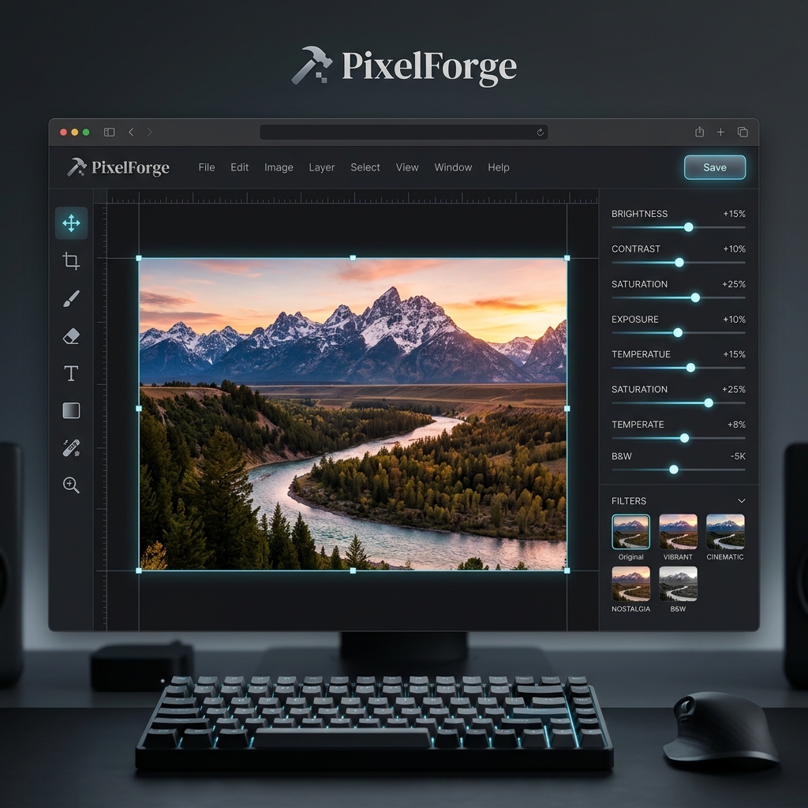
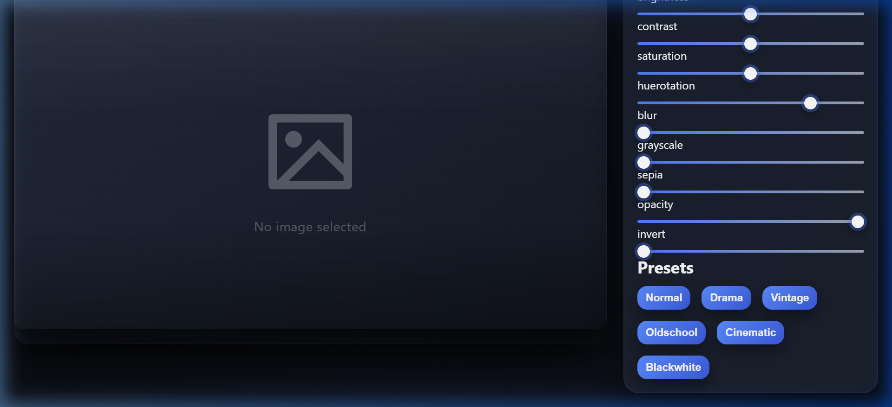

# 📸 PixelForge — Professional Image Editor



PixelForge is a powerful, browser-based image editing tool designed for simplicity and speed. Built with pure JavaScript, it offers a suite of professional filter and presets to transform your photos instantly without the need for heavy software.

---

## 🚀 Live Demo

Experience PixelForge in action:  
**[👉 View Live Project](https://harsha5200-d.github.io/Image_Editor/)**

---

## 🖼️ Live Preview



---

## ✨ Features

- **🎯 Real-time Adjustments**: Fine-tune your images with instant feedback.
- **🎨 Professional Filters**:
  - Brightness, Contrast, and Saturation.
  - Hue Rotation for creative color shifts.
  - Blur, Grayscale, and Sepia for artistic effects.
  - Opacity and Inversion controls.
- **🎭 One-Click Presets**:
  - **Drama**: Bold and high-contrast.
  - **Vintage**: Classic film look.
  - **Cinematic**: Professional movie-style grading.
  - **Black & White**: Timeless monochrome.
- **📥 Fast Export**: Download your edited masterpieces in high quality.
- **♻️ Smart Reset**: Quickly revert all changes to start fresh.

---

## 🛠️ Technology Stack

PixelForge is built using modern web technologies to ensure performance and cross-browser compatibility:

- **HTML5**: Semantic structure and Canvas API.
- **CSS3**: Modern layout with Flexbox and CSS Variables for custom themes.
- **JavaScript (ES6+)**: Vanilla JS for high-performance image processing.
- **Remix Icons**: High-quality SVG icons for a premium UI.

---

## 📦 How to Use Locally

1. **Clone the repository:**
   ```bash
   git clone https://github.com/harsha5200-d/Image_Editor.git
   ```
2. **Navigate to the project folder:**
   ```bash
   cd Image_Editor
   ```
3. **Open `index.html` in your browser.**

---

## 🤝 Contributing

Contributions are welcome! If you have suggestions for new filters or presets, feel free to open an issue or submit a pull request.

1. Fork the Project
2. Create your Feature Branch (`git checkout -b feature/AmazingFeature`)
3. Commit your Changes (`git commit -m 'Add some AmazingFeature'`)
4. Push to the Branch (`git push origin feature/AmazingFeature`)
5. Open a Pull Request

---

## 📄 License

Distributed under the MIT License. See `LICENSE` for more information.

---

<p align="center">
  Built with ❤️ by <a href="https://github.com/harsha5200-d">Harsha</a>
</p>
